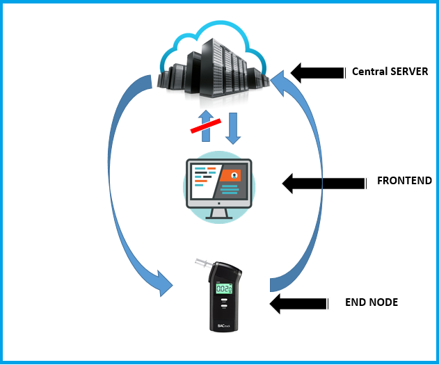
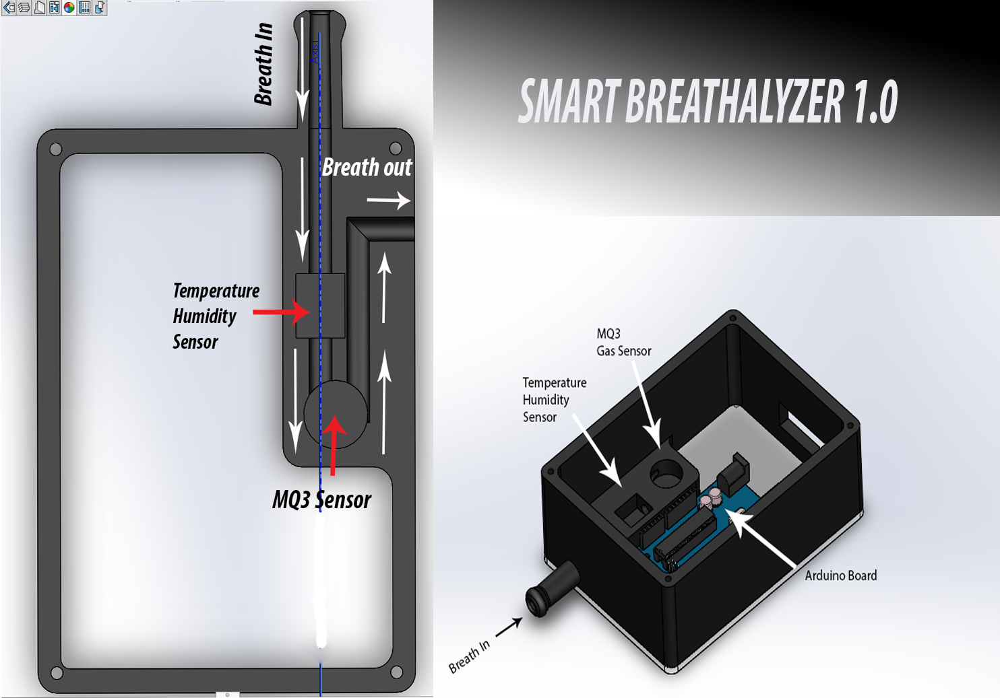
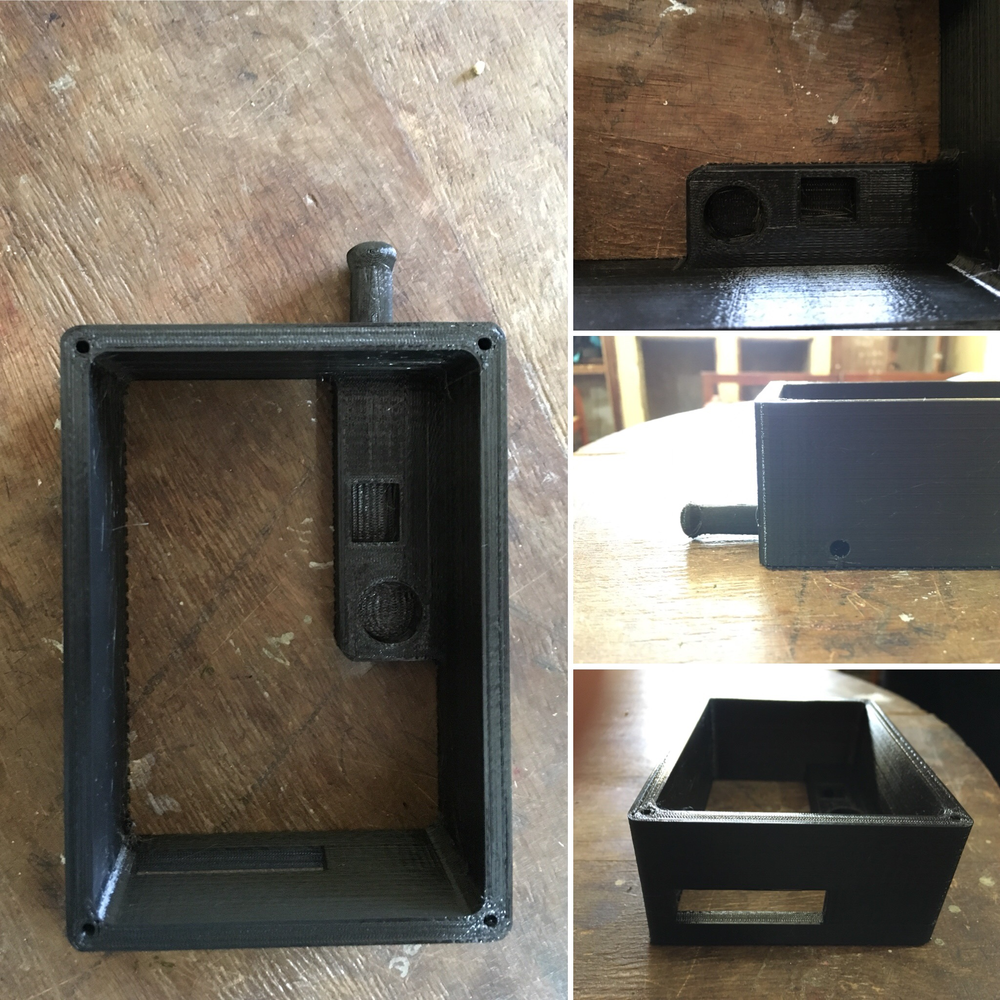

[comment]: # "This is the standard layout for the project, but you can clean this and use your own template"

# Smart Breathalyzer Test

---

## Team
-  E/14/010, ADIKARI A.M.N.P., [e14010@eng.pdn.ac.lk](mailto:e14010@eng.pdn.ac.lk)
-  E/14/028, BANDARA D.M.N.T., [e14028@eng.pdn.ac.lk](mailto:e14028@eng.pdn.ac.lk)
-  E/14/065, DASSANAYAKA D.S.M.M.B., [e14065@eng.pdn.ac.lk](mailto:e14065@eng.pdn.ac.lk)

## Table of Contents
1. [Introduction](#introduction)
2. [Solution Architecture](#solution-architecture )
3. [Hardware & Software Designs](#hardware-and-software-designs)
4. [Links](#links)

---

## Introduction

This project is mainly targeted for the Police Department in Sri Lanka. Until now they use conventional balloon test to identify drunk drivers. Providing an easy , efficient  and more secure iot based solutions replacing old conventional method our aim is to reduce the chance of escaping such situations by bribing.

Our project is to innovate a digital alcohol meter equipment communicating with a secured database-system with a user friendly GUI. We are aiming to produce two of such devices. These devices interact with the remote central server along with other local servers which will be located at regional police departments.These devices has their own ids. This method is fully automated such that the police officer has no any authority over the device. Once the police officer checks with the equipment the device automatically does everything to file a legal action against the drunk driver. And also we are developing our database such that only the higher level authority can interact with the informations. Once the data is sent to the remote server it sends a reply to the device requesting driver and vehicle informations which can be entered using the keypad included into the device itself. It is the only thing the police officer has to do.  

For this project basically we intend to use

- alcohol sensor for each device

- microcontroller (arduino)

- a keypad

- A GSM module

## Solution Architecture

### Embedded Systems Design

- Alcohol percentage in breath is measured using the MQ3 gas sensor which is calibrated to response to alcohol gas.
- Temperature and humidity sensors are used in the aim of getting accurate results in any changing environment.
- Design of the Smart breathalyzer device is completely innovated by us.
- Device is embedded with an Arduino uno, MQ3 sensor along with temperature and humidity sensors and a GSM/GPRS module to communicate with the server.
- A keypad, lcd display is attached to the module itself.
Design templates and final outcome of the Embedded systems will be followed by this post. 

### Web and Network Application Design

A GSM module connected at each end is used to communicate between the device and the central server.

GPRS is used to transfer data packets from the end node to the central server via the Internet.

TCP is used as Transport Layer protocols and IP is used as Network Layer Protocol.

#### Back end

The following technologies are used to develop the back end web application

   1. Node.js with Express

   2. Free web hosting service like AWS

#### Front end

   - Javascript supported Frontend Framework such as Vue.js, AngularJS or REACT

  

### Computer and Network Security

 Driver License Number and Vehicle Number are the data that has to be sent to the central server from the device. Therefore there is not much security aspects involved in the device aspect.

 

But when considering server

   1. No one should be able to edit, delete, or change data

   2. Accessing website should be secured (Only authorized persons should enter)  

   3. Should establish a secure connection  between device and server such that no any external device can enter data to server.       

   

## Hardware and Software Designs

#### Smart Breathalyzer Design  

  

#### 3D Print Output  
  

#### [Final Product Demo Video](https://youtu.be/idNMS8BCQNw)  

#### Documents  
- [Project Document](data/documents/1.pdf)  
- [Design Document](data/documents/2.pdf)  

## Links

- <a href = "https://github.com/cepdnaclk/e14-3yp-Smart-Breathalyzer-Test" target = "_blank">Project Repository</a>
- <a href = "https://cepdnaclk.github.io/e14-3yp-Smart-Breathalyzer-Test/" target = "_blank">Project Page</a>
- <a href = "http://www.ce.pdn.ac.lk/" target = "_blank">Department of Computer Engineering</a>
- <a href = "https://eng.pdn.ac.lk/" target = "_blank">University of Peradeniya</a>

[//]: # (Please refer this to learn more about Markdown syntax)
[//]: # (https://github.com/adam-p/markdown-here/wiki/Markdown-Cheatsheet)
